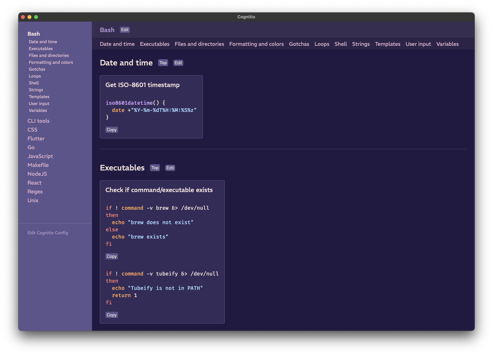
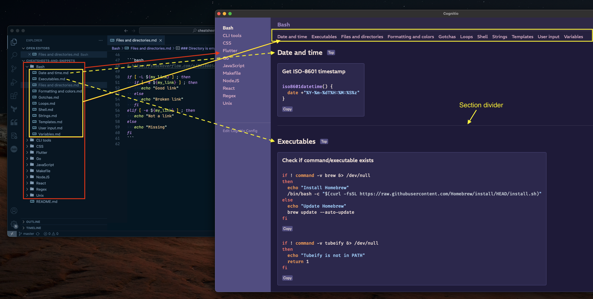
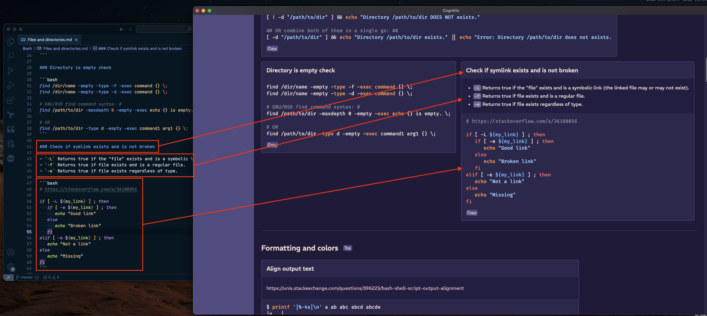

# Cognitio

Developer cheatsheets and code snippets via Markdown.



Status: Alpha, with known bugs.

### Known bugs

- The `Edit Cognitio Config` button doesn't work when the app is built using `npm run tauri build` but works fine during development with `npm run tauri dev`. The app crashes when used.
- The edit button in the upper right hand corner doesn't work, same situation as above.
- Detecting file changes and automatically reloading cheatsheets seems flaky when the app is built for distribution but works fine during development.
- No view/inapropriate view when there are no entries in the `cheatsheets` list (in `cognitio.yaml`).

## How to get started

### Setup

1. Create the app's config file `cognitio.yaml` somewhere on your machine.

```yaml
editor: code
cheatsheets:
  - path/to/cheatsheet/dir
```

- `editor` is the command to invoke when the "Edit" or "Edit Cognitio Config" buttons are used. In the example above, Visual Studio Code is used (similar to using `code .` on the terminal).
- `cheatsheets` is a list of paths to where your snippets or cheatsheets are stored.

2. Set the `COGNITIO_HOME` environment variable to be the path to the directory where `cognitio.yaml` is stored.

### Writing content

Use directories to make your menu and files to make sections:



Section each snippet with h3 (`###`) headings and write text and code as normal:



All content that is not h3 headings or code blocks are shown in a darker blue/purple section in each card. This can be used to make sections inside each card.

## Developing

Run local dev server:

```
npm run tauri dev
```

Show browser dev tools in running app:

```
CMD+OPT+I
```

### Misc

Generate app icon:

```
npm run tauri icon ./logo/logo.png
```

Build distributable:

```
npm run tauri build
```

Builds are then located under `./src-tauri/target/release/bundle`.

### Scaffolding used to create project:

https://tauri.app/v1/guides/getting-started/setup/sveltekit

- With TypeScript.
- With Prettier and ESLint.
- With Vitest for testing but without browser testing.

# TODO:

https://rust-lang-nursery.github.io/rust-cookbook/development_tools/debugging/config_log.html#log-messages-to-a-custom-location
